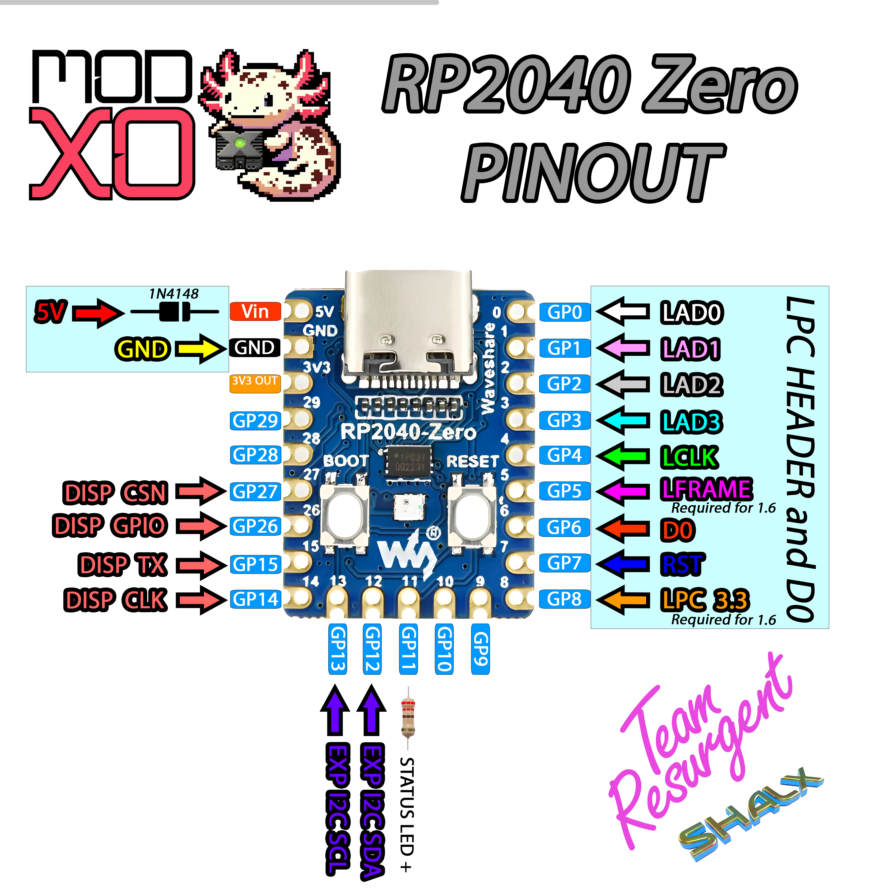

 

[](https://github.com/Team-Resurgent/Repackinator/blob/main/LICENSE.md)
[](https://github.com/Team-Resurgent/Modxo/actions/workflows/BundleModxo.yml)
[](https://discord.gg/VcdSfajQGK)
<!--Translated by: Emmanuelito18-->

# Vertaalde versies

> [!NOTE]
> Sommige vertalingen kunnen verouderd zijn, het kan langer duren voordat deze zijn bijgewerkt. De Engelse versie is altijd de meest recente versie.

 - [English](https://github.com/Team-Resurgent/Modxo)
 - [Español](https://github.com/Team-Resurgent/Modxo/blob/main/README%20ES-MX.md)
 - Binnenkort meer vertalingen
 

# Modxo

Modxo (uitgesproken als "Modsho") is een RP2040-firmware die een Raspberry Pi Pico (of een soortgelijk RP2040-gebaseerd microcontrollerbord) omzet in een compatibel LPC-randapparaat voor de originele xbox.

Met Modxo kun je een Xbox BIOS-image laden via de LPC-poort en compatibele randapparatuur zoals HD44780-beeldschermen of adresseerbare RGB-LED's aansturen met compatible xbox software.

Modxo is geen modchip. Terwijl oudere modchips grotendeels afhankelijk zijn van verouderde hardware, zoals LPC-flashgeheugenchips of dure programmeerbare logische IC's, is Modxo de eerste volledig softwaregedefinieerde implementatie van een LPC-randapparaat. Het is open-sourcesoftware, grotendeels geschreven in C, ontwikkeld met de officiële Raspberry Pi Pico SDK en ontworpen om te draaien op RP2040-gebaseerde hardware.

Er is geen speciale hardware of ingewikkelde tools nodig om Modxo op een compatibel apparaat te installeren. In de meeste gevallen is alleen een USB-kabel voldoende. De installatie verloopt vrijwel hetzelfde als bij oudere apparaten – alles wat nodig is, is een compatibel RP2040-microcontrollerbord, een paar weerstanden, draad en basis soldeergereedschap. Er bestaan ook "Modxo Adapters", dit zijn aangepaste PCB's om het installatieproces nog verder te vereenvoudigen.

## Installatie richtlijnen
### Benodigdheden
- Een Xbox (elke revisie) met een werkende LPC-poort. Xbox revisie 1.6 vereist een herbouw van de LPC-poort.
- Een RP2040-microcontrollerbord. Sommige RP2040 replica borden zijn mogelijk niet compatibel. Compatibele borden waarvan bekend is dat ze met Modxo werken, zijn onder andere:
  - Officiële Raspberry Pi Pico
  - Officiële Raspberry Pi Pico 2
  - YD-RP2040
  - RP2040 Zero/Tiny
  - XIAO RP2040
- 4 100 Ohm-weerstanden (getest met 1/4 W-weerstanden)
- 1 1N4148-diode (optioneel, maar sterk aanbevolen bij bepaalde microcontrollerborden; zie hieronder voor bord-specifieke installatie instructies)

### Firmware flashen

#### BIOS verpakken
1. Ga naar [https://team-resurgent.github.io/modxo/](https://team-resurgent.github.io/Modxo/)
2. Sleur en pleur uw BIOS-bestand
3. UF2-bestand met BIOS-image wordt gedownload

#### Flashen van een enkele BIOS

> [!IMPORTANT]
> De volgende stappen zijn niet nodig als u PrometheOS wilt gebruiken. In dit geval flasht u gewoon PrometheOS-{board variant}.uf2 rechtstreeks...

1. Sluit de Raspberry Pi Pico aan op een pc met de BOOTSEL-knop ingedrukt (of een vergelijkbare knop op compatibele RP2040-hardware). Er zal dan een nieuw schijfstation beschikbaar komen.
2. Kopieer Modxo-{board variant}.uf2 naar de Raspberry Pi Pico Drive.
3. Sluit de Raspberry Pi Pico opnieuw aan met de BOOTSEL-knop ingedrukt. Zo wordt de vorige schijf weer weergegeven.
4. Kopieer uw BIOS UF2-bestand naar de drive

#### Stappen om PrometheOS op Modxo te updaten

> [!IMPORTANT]
> De volgende stappen zijn alleen nodig als u PrometheOS wilt updaten met Modxo-updates/bugfixes...

1. Ervan uitgaande dat PrometheOS-{board-variant}.uf2 al geflasht is.
2. Sluit de Raspberry Pi Pico aan op een pc met de BOOTSEL-knop ingedrukt (of een vergelijkbare knop op compatibele RP2040-hardware). Er zal dan een nieuw schijfstation beschikbaar komen.
3. Kopieer Modxo-{board variant}.uf2 naar de Raspberry Pi Pico Drive.
   
### Bedradingsschema's
---
#### LPC Poort
   

   > [!NOTE]
   > * Voor xbox revisie 1.0 - 1.5 is D0 vereist, tenzij deze geaard is.
   > * LFrame- en LPC 3.3V-aansluitingen zijn vereist vanaf xbox revisie 1.6 of wanneer de Pico op een USB-poort wordt aangesloten.
   > * LFrame is niet vereist voor USB debugging.
   > * Herbouw van de LPC-poort is vereist voor xbox revisie 1.6.

---
#### Officiële Raspberry Pi Pico

   

   > [!NOTE]
   > Voeg de diode toe als u de Pico via USB aansluit. Zo voorkomt u dat de 5V-pin van de LPC via de USB-kabel van stroom wordt voorzien, wat onbedoelde gevolgen kan hebben.
---
#### Officiële Raspberry Pi Pico 2

   

   > [!NOTE]
   > Voeg de diode toe als u de Pico via USB aansluit. Zo voorkomt u dat de 5V-pin van de LPC via de USB-kabel van stroom wordt voorzien, wat onbedoelde gevolgen kan hebben.
---
#### YD-RP2040

   

   > [!NOTE]
   > Vergeet niet om soldeer toe te voegen aan jumper R68 als u de ingebouwde RGB-led gebruikt
---
#### RP2040-Zero/Tiny

   

   > [!NOTE]
   > Voeg de diode toe als u de Pico via USB aansluit. Zo voorkomt u dat de 5V-pin van de LPC via de USB-kabel van stroom wordt voorzien, wat onbedoelde gevolgen kan hebben.
---
#### XIAO-RP2040

   

---

## Instructies voor het bouwen van firmware

### Windows
1.- Download en installeer [Visual Studio Code](https://code.visualstudio.com/download)

2.- Installeer extentie: "Raspberry Pi Pico"


3.- Zorg ervoor dat SDK 2.0.0 is geselecteerd zoals hieronder...


4.- Ga naar het tabblad Raspberry Pi Pico en klik op "Configure CMake"

5.- Ga naar het tabblad Run and Debug en selecteer Build for your board

6.- Klik "Start Debugging" (Groene pijl)

7.- UF2-bestand wordt gegenereerd in de Build-map


### Docker
#### Setup
Bouw uw basis docker-image met
```
docker build -t modxo-builder .
```

#### Firmware-build
```
docker compose run --rm builder
```

De output zal zijn `out/modxo_[pinout].uf2`

Er zijn ook enkele extra parameters die aan het buildscript kunnen worden toegevoegd:

- MODXO_PINOUT=`official_pico` | `yd_rp2040` | `rp2040_zero` | `xiao_rp2040` - Default is `official_pico`.

- CLEAN=`y`: triggers a clean build. Default is disabled.

- BUILD_TYPE=`Release` | `Debug` - Default is `Debug`.


_Voorbeelden:_
```
MODXO_PINOUT=rp2040_zero BUILD_TYPE=Release docker compose run --rm builder
```
```
CLEAN MODXO_PINOUT=yd_rp2040 docker compose run --rm builder
```

#### Bios lokaal verpakken
Plaats uw BIOS-bestand met de naam `bios.bin` in deze directory of plaats alle bios-bestanden (ongeacht hun naam) in de bios-directory
```
docker compose run --rm bios2uf2
```

---

## Bekende bugs
 * Windbg loopt soms vast wanneer deze is aangesloten op de seriële poort van Modxo SuperIO

## Notes

  > [!IMPORTANT]
  > Momenteel gebruikt Modxo de ID 0xAF. Idealiter zou afgeleide hardware met aanzienlijke wijzigingen een andere ID moeten gebruiken. Dit is zodat software zoals PrometheOS zijn functies optimaal kan afstemmen.

## Vereisten voor bronvermeldingen

     a) **bronvermelding:**  
       Als u dit werk verspreidt of wijzigt, moet u de oorspronkelijke auteurs correct vermelden. Dit omvat:
       - Vermelding van de originele projectnaam: `Modxo`.
       - Vermelding van de originele auteurs: `Shalx / Team Resurgent`.
       - Inclusief een link naar de originele projectrepository:
           `https://github.com/Team-Resurgent/Modxo`.
       - Eventuele wijzigingen duidelijk vermelden.

    b) **logo en merkstrategie**  
        Elk afgeleid werk of elke distributie moet de logo's bevatten die door
        de oorspronkelijke auteurs zijn aangeleverd, in overeenstemming met de Branding richtlijnen. 
        De logo's moeten prominent worden weergegeven in elke interface of documentatie
        waar naar het oorspronkelijke project wordt verwezen of waar de bron wordt vermeld.

    c) **Branding richtlijnen:**  
       U vindt de logo's en gedetailleerde branding richtlijnen in het
       bestand `BRANDING NL.md` dat bij dit project is geleverd. De logo's mogen niet op een manier worden
       gewijzigd die de oorspronkelijke branding zou vertekenen of verkeerd zou weergeven.
