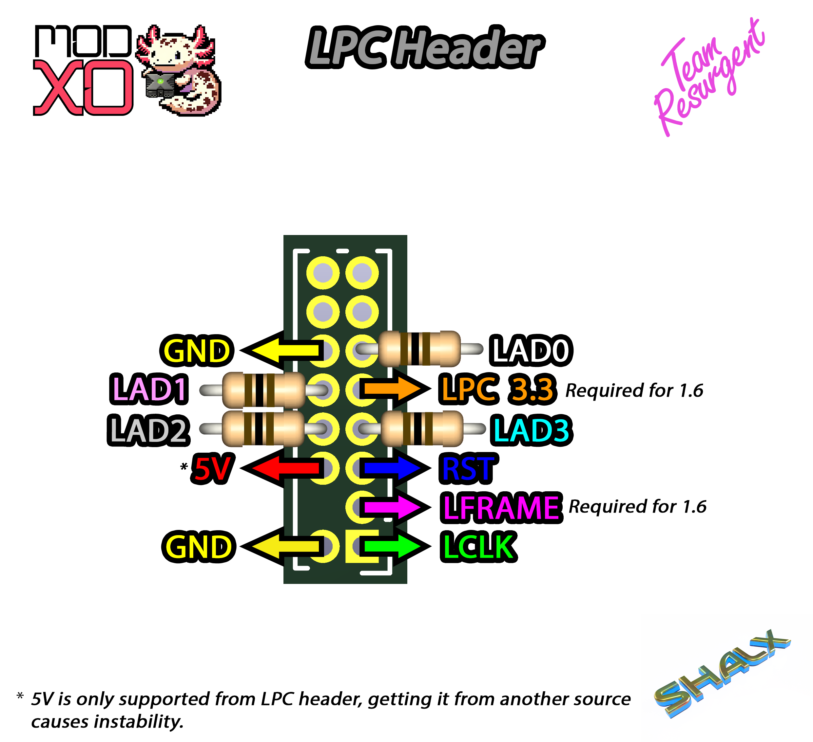
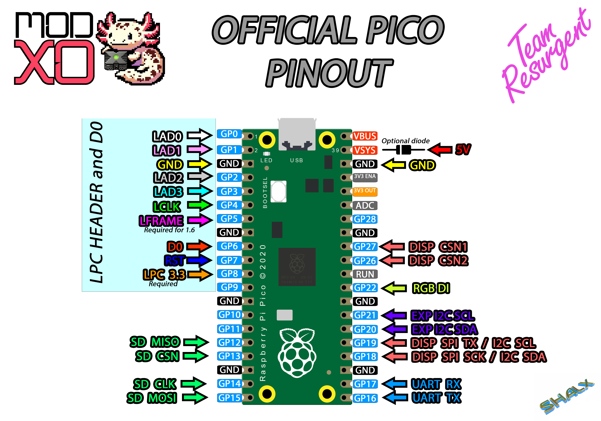
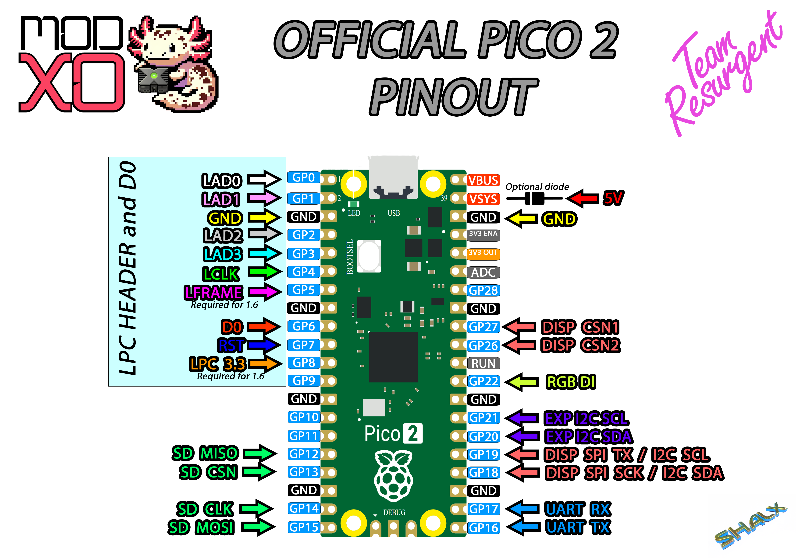
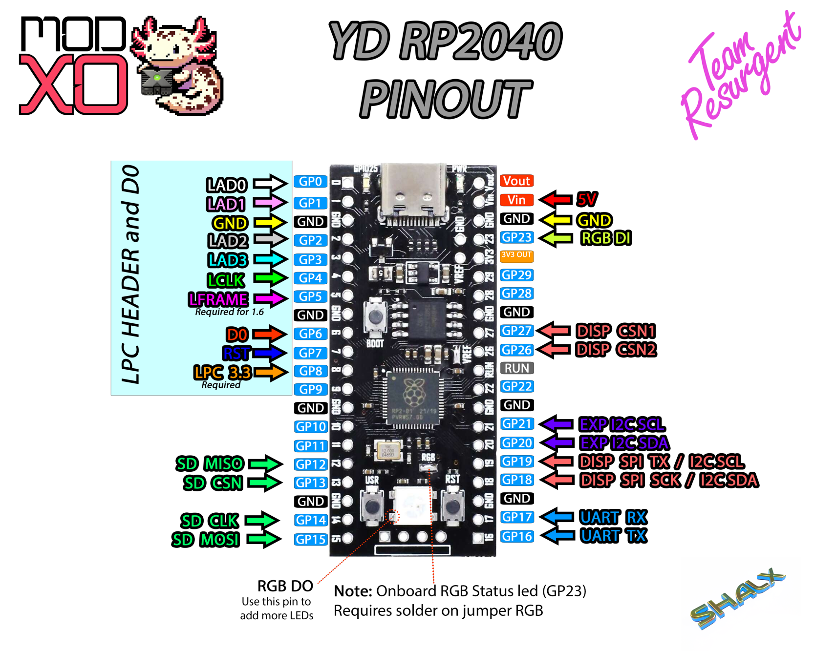
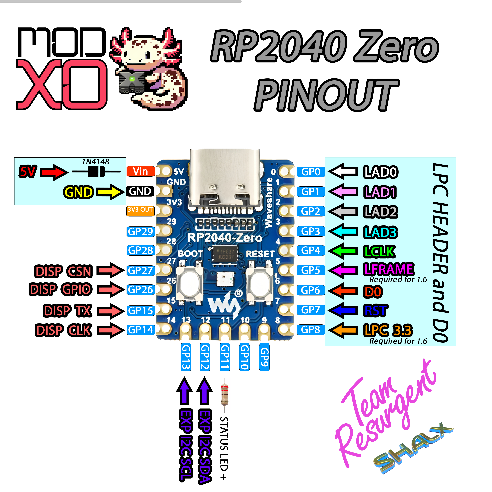
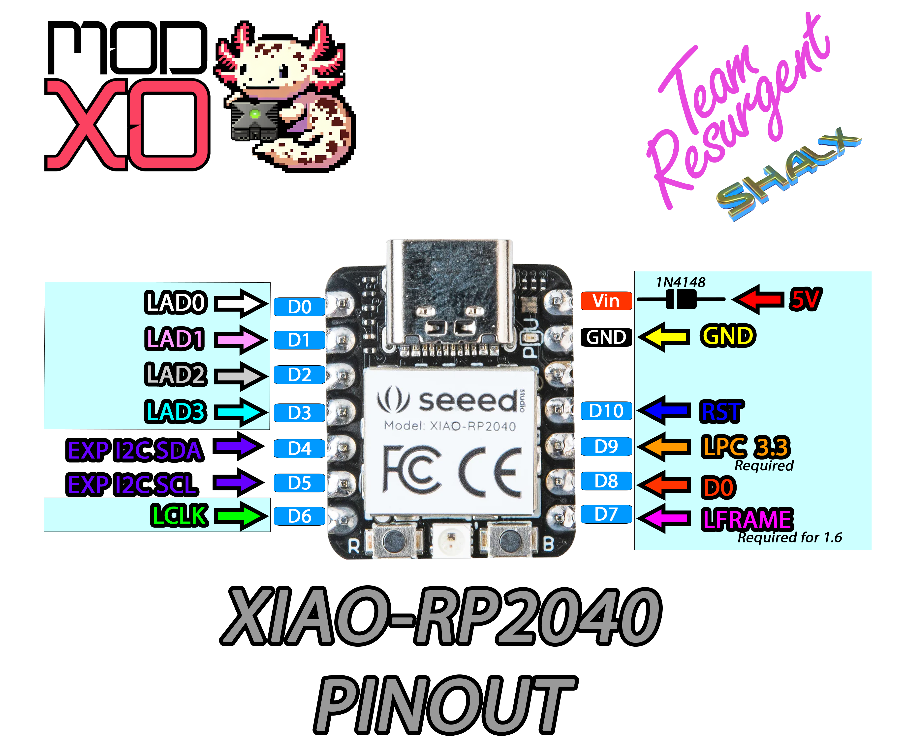
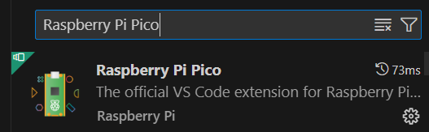
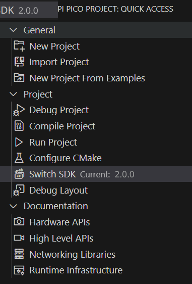

 

[](https://github.com/Team-Resurgent/Repackinator/blob/main/LICENSE.md)
[](https://github.com/Team-Resurgent/Modxo/actions/workflows/BundleModxo.yml)
[](https://discord.gg/VcdSfajQGK)

# Translated versions
*Note: some translations could be outdated and may take a while to be updated than english version.

 - [English](https://github.com/Team-Resurgent)
 - [Español](https://github.com/Team-Resurgent/Modxo/blob/main/README%20ES-MX.md)
 

# Modxo

Modxo (pronnounced "Modsho") is an RP2040 firmware that converts a Raspberry Pi Pico (or similar RP2040-based device) into an Original Xbox-compatible LPC peripheral device. 

Modxo can be used for loading an Xbox BIOS image from the LPC port, as well as for interfacing compatible Xbox software with peripheral devices such as HD44480 displays or addressable RGB LEDs.

Modxo is *not* a modchip. Whereas legacy modchips rely on largely obsolete hardware like LPC flash storage chips or expensive programmable logic ICs, Modxo is the first fully software-defined implementation of an LPC peripheral device. It is open source software, mostly written in C, developed using the official Raspberry Pi Pico SDK and designed to run on RP2040-based hardware. 

No specialized hardware or complicated tooling is needed to load Modxo on a compatible device -- in most cased just a USB cable is all that is necessary. And installation works much like legacy devices -- all that is needed for installation is a compatible RP2040-based device, a few resistors, wire and basic soldering equipment. Custom PCBs exist to simplify the installation process even further.

## How to Install
### Requirements
- An Xbox (any revision) with a working LPC Port. 1.6 Xboxes will need an LPC rebuild.
- A RP2040 development board. There may be some clone boards that are not compatible. The following boards are known to work with Modxo:
- - Official Raspberry Pi Pico
  - Official Raspberry Pi Pico 2
  - YD-RP2040
  - RP2040 Zero/Tiny
  - XIAO RP2040
- 4 100 Ohm resistors (tested with 1/4 W resistors)
- 1 1N4148 Diode (technically optional but highly recommended with certain development boards, see board-specific installation instructions below for more information)

### Flashing firmware

#### Packing Bios
1. Go to [https://team-resurgent.github.io/modxo/](https://team-resurgent.github.io/Modxo/)
2. Drag and Drop your bios file
3. UF2 File with bios image will be downloaded

#### Flashing steps (Single Bios)

The following steps are not required if you intend to use PrometheOS, and just flash PrometheOS-{board-variant}.uf2 directly...

1. Connect Raspberry Pi Pico to a PC with BOOTSEL button (or equivalent button on compatible RP2040 hardware) pressed and a new drive will become available.
2. Copy Modxo-{board variant}.uf2 into the Raspberry Pi Pico Drive.
3. Reconnect Raspberry Pi Pico with BOOTSEL button pressed, so the previous drive will showup again.
4. Copy your bios UF2 file into the drive

#### Upgrading PrometheOS's Modxo steps 

The following steps are only needed if wanting to upgrade PrometheOS with Modxo updates/fixes...

1. Assuming PrometheOS-{board-variant}.uf2 is already flashed.
2. Connect Raspberry Pi Pico to a PC with BOOTSEL button (or equivalent button on compatible RP2040 hardware) pressed and a new drive will become available.
3. Copy Modxo-{board variant}.uf2 into the Raspberry Pi Pico Drive.
   
### Wiring diagrams
---
#### LPC Header
   

  Notes:
  * D0 is required for versions 1.0 - 1.5 unless it is grounded.
  * LFrame and LPC 3.3V connections are required by version 1.6 or when connecting the Pico to USB port.
  * LFrame is not required for USB debug.
  * LPC Rebuild is required for version 1.6
---
#### Official Raspberry Pi Pico

   

   * Note: Please add the diode if connecting the Pico to USB. This avoid powering the LPC 5V Pin from the USB cable which could have unintended consequences.
---
#### Official Raspberry Pi Pico 2

   

   * Note: Please add the diode if connecting the Pico to USB. This avoid powering the LPC 5V Pin from the USB cable which could have unintended consequences.
---
#### YD-RP2040

   

   * Note: Dont forget to add solder to jumper R68 if using the onboard RGB Led
---
#### RP2040-Zero/Tiny

   

   * Note:  Please add the diode if connecting the Pico to USB. This avoid powering the LPC 5V Pin from the USB cable which could have unintended consequences.
---
#### XIAO-RP2040

   

---

## Firmware Build Instructions

### Windows
1.- Download and Install [Visual Studio Code](https://code.visualstudio.com/download)

2.- Install extension: "Raspberry Pi Pico"



3.- Ensure SDK 2.0.0 selected as below...



4.- Go to Raspberry Pi Pico Tab and click "Configure CMake"

5.- Go to Run and Debug Tab and select Build for your board

6.- Click "Start Debugging" (Green arrow)

7.- UF2 File will be generated on Build folder


### Docker
#### Setup
Build your base docker image with
```
docker build -t modxo-builder .
```

#### Firmware Build
```
docker compose run --rm builder
```

Output will be `out/modxo_[pinout].uf2`

There are also some extra parameters that can be passed to the build script:

- MODXO_PINOUT=`official_pico` | `yd_rp2040` | `rp2040_zero` | `xiao_rp2040` - Default is `official_pico`.

- CLEAN=`y`: triggers a clean build. Default is disabled.

- BUILD_TYPE=`Release` | `Debug` - Default is `Debug`.


_Examples:_
```
MODXO_PINOUT=rp2040_zero BUILD_TYPE=Release docker compose run --rm builder
```
```
CLEAN MODXO_PINOUT=yd_rp2040 docker compose run --rm builder
```

#### Packing Bios locally
Place your bios file named `bios.bin` in this directory or place any bios files (regardless of their name) in the bios directory
```
docker compose run --rm bios2uf2
```

---

## Known bugs
 * Windbg get stuck sometimes when connected to Modxo SuperIO's serial port

## Notes
 * Currently, Modxo uses the ID 0xAF. Any derivative hardware with significant changes should ideally use a different ID. This is so that software like PrometheOS can target features appropriately.

## Attribution Requirement

     a) **Attribution:**  
       If you distribute or modify this work, you must provide proper 
       attribution to the original authors. This includes:
       - Mentioning the original project name: `Modxo`.
       - Listing the original authors: `Shalx / Team Resurgent`.
       - Including a link to the original project repository: 
           `https://github.com/Team-Resurgent/Modxo`.
       - Clearly stating any modifications made.

    b) **Logo and Branding:**  
       Any derivative work or distribution must include the logos provided by
       the original authors in accordance with the branding guidelines. The 
       logos must be displayed prominently in any interface or documentation 
       where the original project is referenced or attributed.

    c) **Branding Guidelines:**  
       You can find the logos and detailed branding guidelines in the 
       `BRANDING.md` file provided with this project. The logos must not be 
       altered in any way that would distort or misrepresent the original 
       branding.
