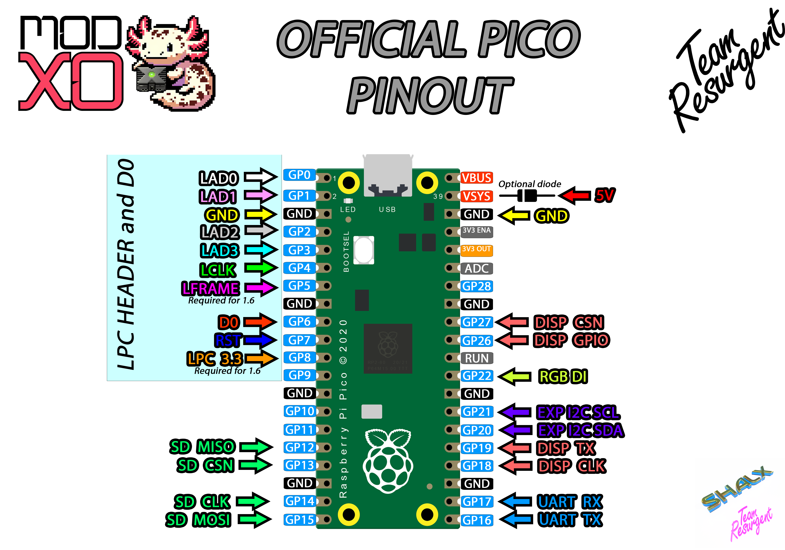
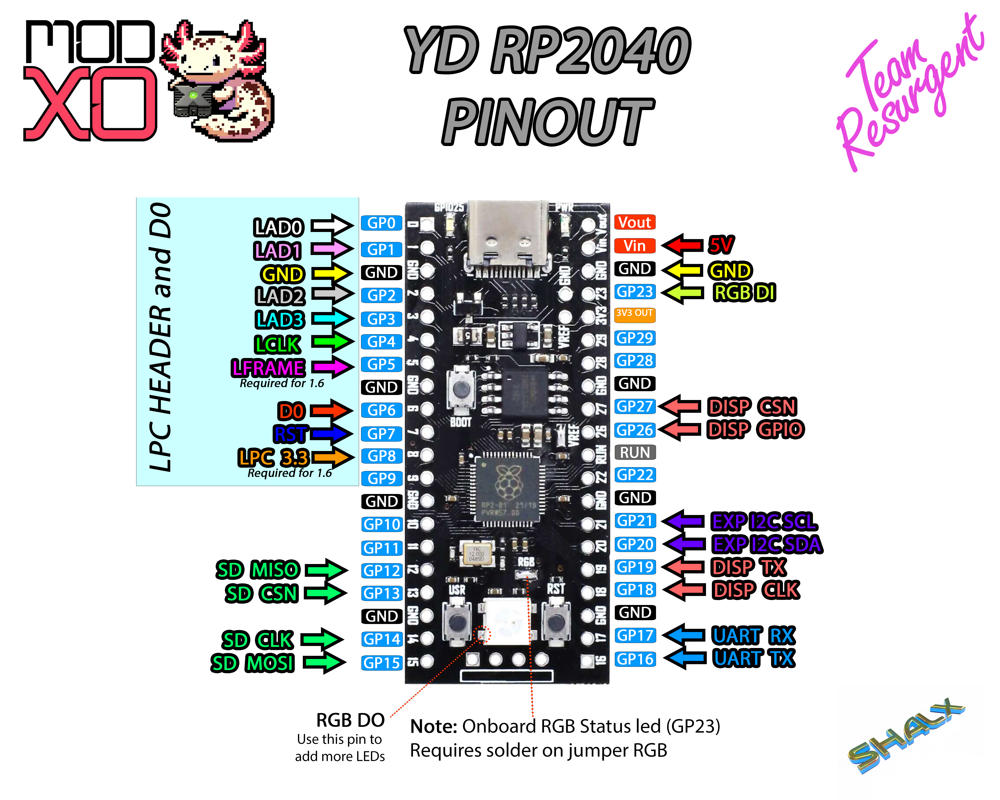

 

[](https://github.com/Team-Resurgent/Repackinator/blob/main/LICENSE.md)
[](https://github.com/Team-Resurgent/Modxo/actions/workflows/BundleModxo.yml)
[](https://discord.gg/VcdSfajQGK)

#

Modxo (pronnounced as "Modsho") is a Xbox LPC Port firmware that converts the Raspberry Pi Pico
into an Original Xbox Modchip that allows running a bios.

# How to Install
### 1. Requirements
- Working LPC Port
- Original Raspberry Pi Pico or RP2040 Zero (There are some clone boards that are not compatible)
- 4 100 Ohm resistors (tested with 1/4 W resistors)

### 2. Wiring diagrams

#### LPC Header


* Note: D0 is required for versions 1.0 - 1.5 unless it is grounded.
* Note: LFrame and LPC 3.3V connections are required by version 1.6 or when connecting the Pico to USB port.
* Note: LFrame is not required for USB debug.
* Note: LPC Rebuild is required for version 1.6

#### Official pico



* Note: Please add the diode if connecting the Pico to USB. This avoid powering the LPC 5V Pin from the USB cable.

#### YD2040



* Note: Dont forget to add solder to jumper R68 if using the onboard RGB Led

### 3. Flashing firmware

#### Packing Bios
1. Go to [https://team-resurgent.github.io/modxo/](https://team-resurgent.github.io/Modxo/)
2. Drag and Drop your bios file
3. UF2 File with bios image will be downloaded

#### Flashing steps
1. Connect Raspberry Pi Pico with BOOTSEL button pressed to a PC and one new drive will appear.
2. Copy Modxo.uf2 into the Raspberry Pi Pico Drive.
3. Reconnect Raspberry Pi Pico with BOOTSEL button pressed, so the previous drive will showup again.
4. Copy your bios UF2 file into the drive

# Firmware Build Instructions

#### Windows
1.- Download and Install [Visual Studio Code](https://code.visualstudio.com/download)

2.- Install extension: "Raspberry Pi Pico"


3.- Ensure SDK 1.5.1 selected as below...


4.- After SDK is installed, git submodules must be updated from command line by running:
```
cd %HOMEPATH%\.pico-sdk\sdk\1.5.1
git submodule update --init --recursive
```
5.- Go to Raspberry Pi Pico Tab and click "Configure CMake"

6.- Go to Run and Debug Tab and select Build for your board

7.- Click "Start Debugging" (Green arrow)

8.- UF2 File will be generated on Build folder


# Docker
#### Setup
Build your base docker image with
```
docker build -t modxo-builder .
```

#
#### Firmware Build
```
docker compose run --rm builder
```

Output will be `out/modxo_[pinout].uf2`

There are also some extra parameters that can be passed to the build script:

- MODXO_PINOUT=`official_pico` | `yd_rp2040` | `rp2040_zero` - Default is `official_pico`.

- CLEAN=`y`: triggers a clean build. Default is disabled.

- BUILD_TYPE=`Release` | `Debug` - Default is `Debug`.


_Examples:_
```
MODXO_PINOUT=rp2040_zero BUILD_TYPE=Release docker compose run --rm builder
```
```
CLEAN MODXO_PINOUT=yd_rp2040 docker compose run --rm builder
```

#### Packing Bios locally
Place your bios file named `bios.bin` in this directory or place any bios files (regardless of their name) in the bios directory
```
docker compose run --rm bios2uf2
```

# Known bugs
 * Windbg get stuck sometimes when connected to Modxo SuperIO's serial port

# Notes
 * Currently, Modxo uses the ID 0xAF. Any derivative hardware with significant changes should ideally use a different ID. This is so that software like PrometheOS can base features available from that returned ID.
 

# Attribution Requirement

     a) **Attribution:**  
       If you distribute or modify this work, you must provide proper 
       attribution to the original authors. This includes:
       - Mentioning the original project name: `Modxo`.
       - Listing the original authors: `Shalx / Team Resurgent`.
       - Including a link to the original project repository: 
           `https://github.com/Team-Resurgent/Modxo`.
       - Clearly stating any modifications made.

    b) **Logo and Branding:**  
       Any derivative work or distribution must include the logos provided by
       the original authors in accordance with the branding guidelines. The 
       logos must be displayed prominently in any interface or documentation 
       where the original project is referenced or attributed.

    c) **Branding Guidelines:**  
       You can find the logos and detailed branding guidelines in the 
       `BRANDING.md` file provided with this project. The logos must not be 
       altered in any way that would distort or misrepresent the original 
       branding.
